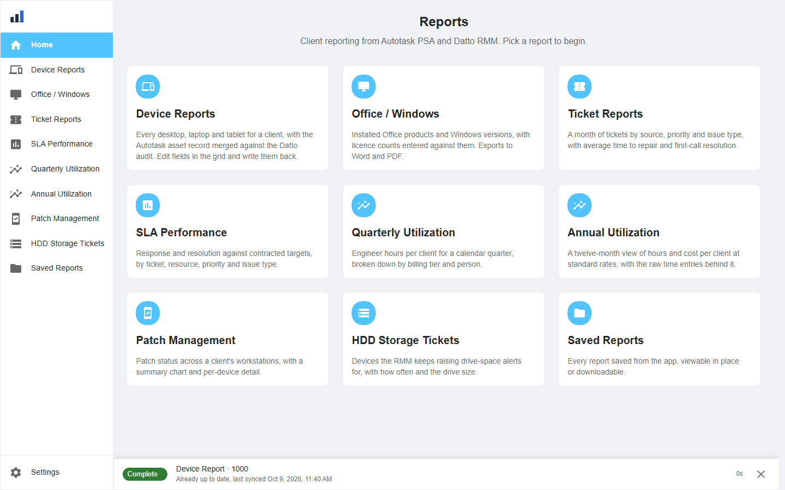
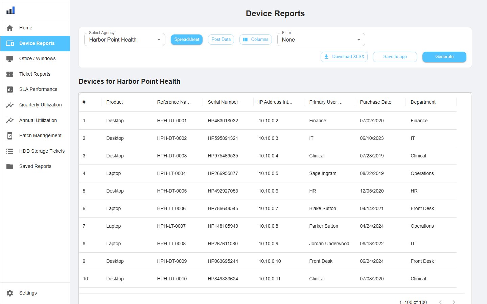
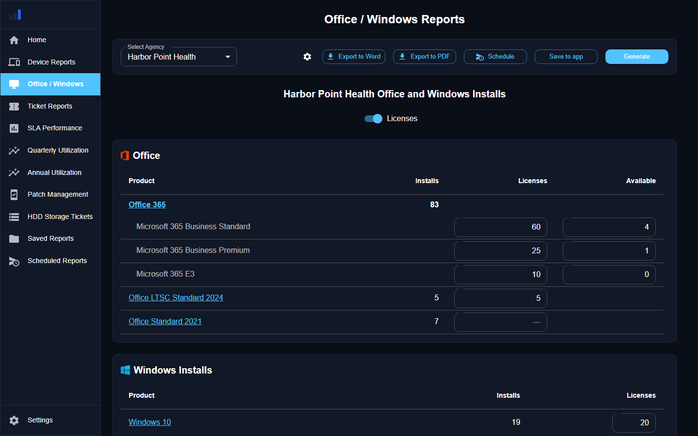
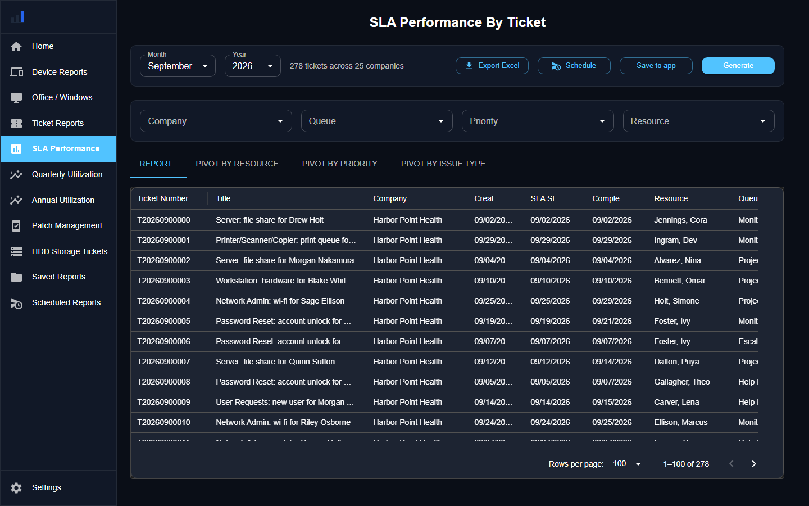
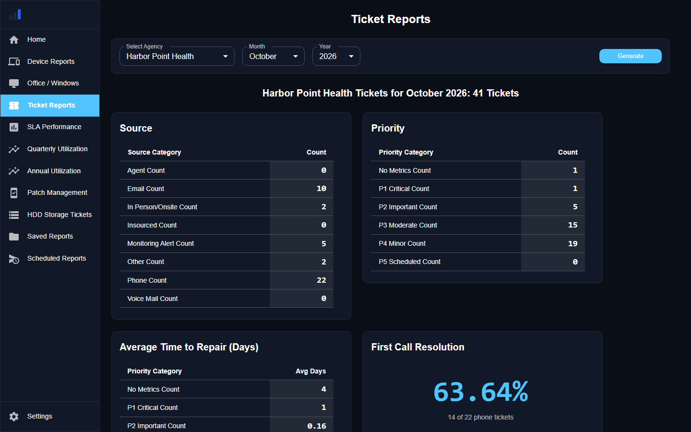
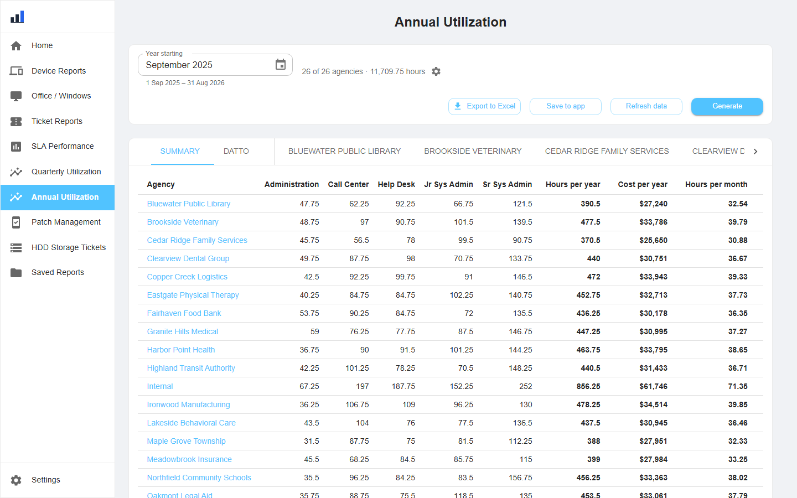
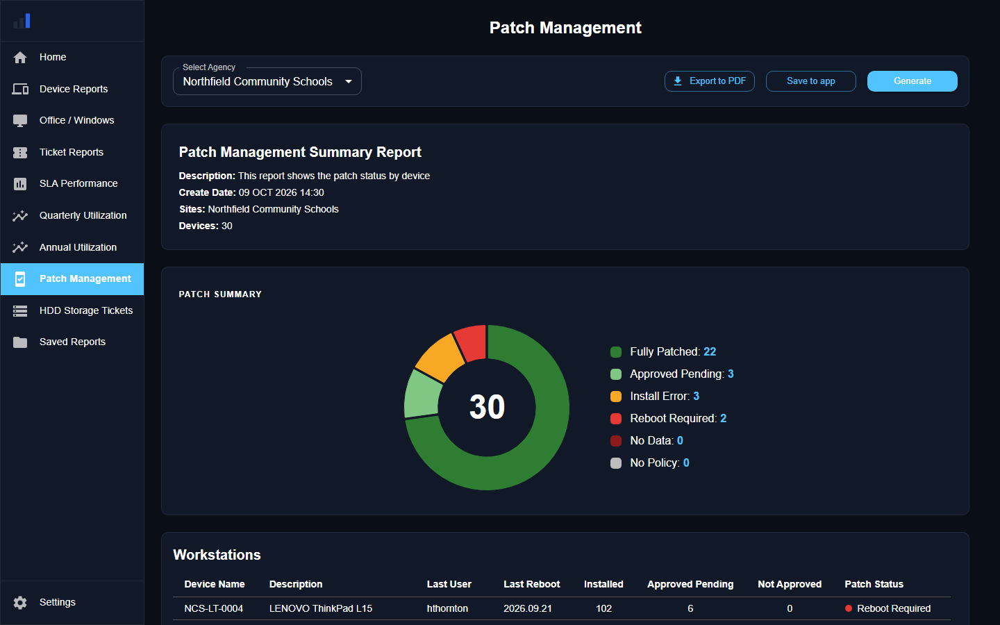
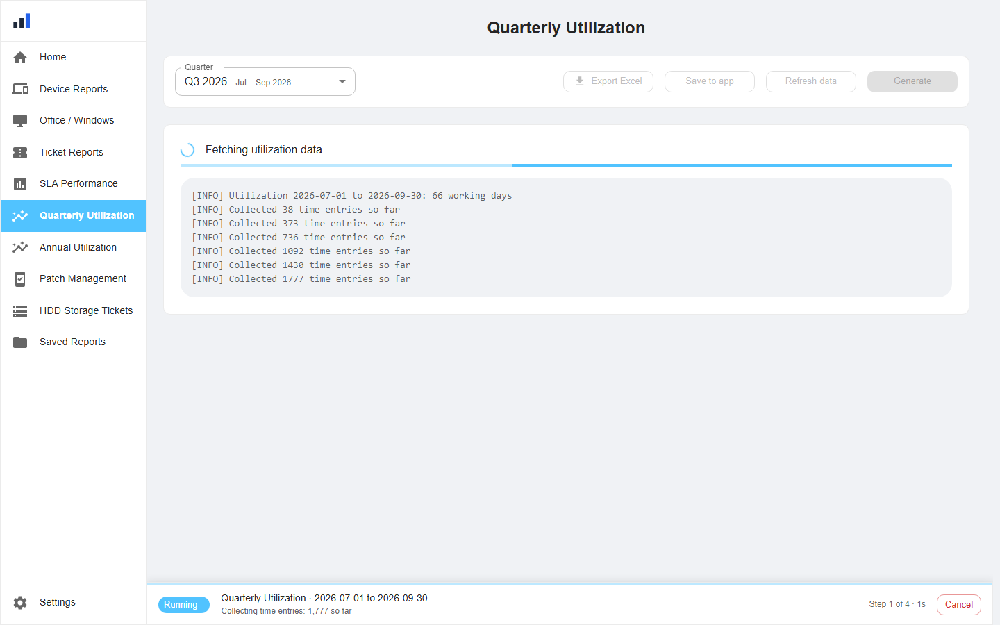
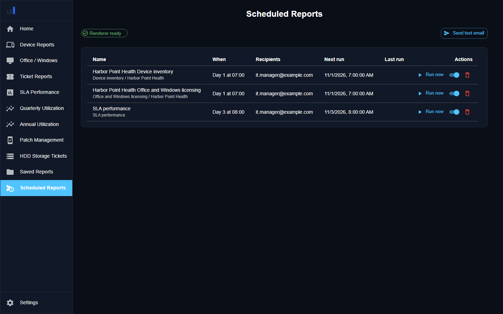
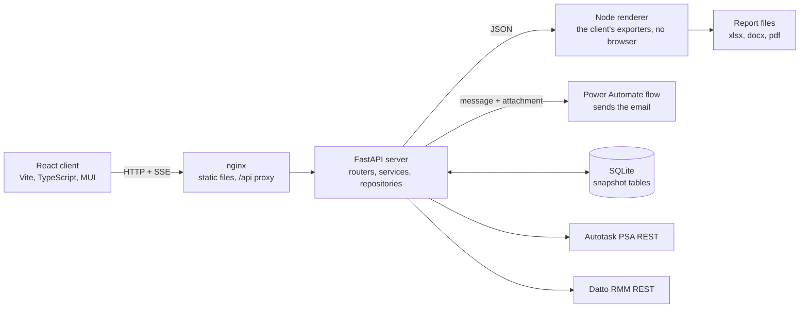

# Autotask + Datto Reporting

[](https://github.com/B-Howell/Autotask-Datto-Reporting/actions/workflows/ci.yml)

A self-hosted reporting platform for managed service providers. It pulls from
Autotask PSA and Datto RMM, reconciles the two views of each client, caches
the result locally, and produces the monthly, quarterly and annual client
reports on screen and as Excel, Word and PDF files. Built for the engineers
and account managers at an MSP who owe every client a report pack each month
and would rather not assemble it by hand.

## The problem

At the MSP this was built for, monthly client reporting meant pulling data out
of Autotask PSA and Datto RMM for 25 clients and about 1,700 devices, joining
the two by hand in spreadsheets, and formatting the result: around 35 reports a
month plus quarterly and annual utilization, roughly 40 hours of manual work
every month. Each portal holds half the picture. Autotask knows the contract,
the ticket and the asset record; Datto knows what the machine actually is and
what is installed on it. Neither answers "what did we do for this client last
month, and what are they running" on its own.

## What it does

| Report | Answers | Exports |
|---|---|---|
| Device inventory | Every desktop, laptop and tablet, with the Autotask asset record merged against the Datto hardware and software audit. Editable in the grid and written back to Autotask. | xlsx |
| Office and Windows licensing | Installed Office products and Windows versions per client, with licence counts entered against them. | docx, pdf |
| Tickets | Volume by source, priority and issue type, average time to repair, first-call resolution. | on screen |
| SLA performance | Response and resolution against contracted targets, by ticket, resource, priority and issue type. | xlsx |
| Quarterly and annual utilization | Engineer hours per client by billing tier, with per-month averages and cost at standard rates. | xlsx |
| Patch management | Patch status across a client's workstations. | pdf |
| Disk-space tickets | Devices the RMM keeps raising "drive nearly full" tickets for. | xlsx |

Reports run as tracked jobs with live progress, can be cancelled, survive a
page reload, and are saved in the app for re-opening later. Several Autotask
companies can be presented as one client. Any report can be scheduled: it
renders itself on a day of the month and goes out by email through a Power
Automate flow, with every run on record.

## Screenshots

All screenshots are taken from the built-in demo data set. Every company,
site, device, user and engineer shown is invented; none is a real client.

| | |
|---|---|
|  |  |
| Home: one card per report | Device inventory, merged from both systems |
|  |  |
| Office and Windows licensing | SLA performance by ticket, with pivots |
|  |  |
| Monthly ticket breakdown | Annual utilization by billing tier |
|  |  |
| Patch status by workstation | A report in flight: phase progress and the server log |
|  | |
| Scheduled reports: each schedule, its next run and its last result | |

## Architecture



The design decisions that matter, and why I made them:

- **SQLite snapshot tables instead of upserts.** Every report's rows are
  stored per scope (an agency, or a month) and replaced whole in one
  transaction on each refresh. The vendor APIs stay the source of truth, so
  there is nothing to merge, a retired device disappears on the next refresh,
  and a schema change is handled by dropping the snapshot rather than
  backfilling. I chose SQLite because the dataset is a few hundred thousand
  rows with one writer, and the stdlib module needs no service to run.
- **Reports are jobs, not requests.** A device report makes hundreds of
  paginated API calls and runs for minutes. Each report streams its log and a
  structured progress line over Server-Sent Events, the server keeps a record
  of the current run so a reload rebuilds the status bar, and cancellation is
  cooperative: the logger every report already calls checks the cancel flag.
- **Vendor clients own the vendor quirks.** Autotask has no page token, so
  the client walks results with an anchored `id > last` cursor and chunks id
  lookups; Datto rate-limits reads, so every call is paced, retried with
  backoff and re-authenticated on a 401. Services never see a URL.
- **Scheduled reports reuse the browser's exporters.** The Excel, Word and
  PDF builders are pure functions of their input, so a small Node service
  runs the same modules without a browser and hands the server the file. One
  implementation per document, built by the same code the export buttons
  run, so the layout never drifts. A run advances its schedule before
  it starts, so a crash cannot send twice, and the mail goes out through a
  Power Automate flow so the app never holds a mailbox credential.
- **Deployment values never live in tracked source.** Credentials, the
  Autotask zone, the Datto platform and the delivery flow URL come from
  `.env`; agency groups, logos and billing rates from `data/tenant.json`;
  tenant rules (picklist ids, SLA targets, billing tiers, fiscal calendar)
  from an untracked `report_rules_local.py` laid over the documented
  `server/report_rules.py`. A private fork of this repository merges
  upstream without conflicts because upstream never touches those files.
- **Demo mode.** `DEMO_MODE=1` swaps the vendor clients for deterministic
  generators that return rows in the real shapes and emit real progress, so
  the whole application runs, and can be demonstrated, with no accounts.
- **CI gates every push.** Ruff, Bandit, pip-audit and pytest on the server;
  ESLint, Prettier, `tsc`, Vitest and a production build on the client; then
  a Docker build of all three images.

The full write-up, including the life of a request, each layer, the cache
design, failure modes and trade-offs, is in
[docs/architecture.md](docs/architecture.md).

## Tech stack

- Server: Python 3.11, FastAPI, uvicorn, sse-starlette, SQLite (stdlib), requests
- Client: React 19, TypeScript (strict), Vite, Material UI 7 with DataGrid and Charts, React Router 7, Zustand
- Exports: exceljs, docx, jsPDF with autotable
- Tooling: Ruff, Bandit, pip-audit, pytest; ESLint, Prettier, Vitest, tsx; GitHub Actions; Docker Compose

## Getting started

Prerequisites: Python 3.11+, Node.js 20+, and for real data an Autotask API
user and a Datto RMM API key.

### Demo mode (no accounts needed)

```bash
docker compose -f docker-compose.yml -f docker-compose.demo.yml up --build
```

The server seeds its cache on first start; the app is at http://localhost.

### Real data

1. Copy the environment file and fill it in. The comments say where each
   value comes from in the vendor UIs.

   ```bash
   cp server/.env.example server/.env
   ```

2. Add the clients to report on in Settings, pairing each Autotask company id
   with its Datto site, or seed `server/data/agencies.json`.

3. Run it:

   ```bash
   docker compose up -d --build
   ```

   `docker-compose.yml` mounts a volume at the server's data directory so the
   database, agency list and saved reports survive redeploys.

Running this for an organisation? Keep the deployment as a private fork and
follow [the fork workflow](docs/operations/Reporting%20Fork%20and%20Upstream%20Workflow.md):
every deployment-specific value has an untracked home, so upstream merges
never conflict.

### Development

```bash
# server, http://localhost:8000
cd server
pip install -r requirements.txt -r requirements-dev.txt
DEMO_MODE=1 python -m demo.seed      # optional: demo data
python main.py

# client, http://localhost:3000 (proxies /api to :8000)
cd client
npm install
npm run dev

# renderer, http://localhost:3100
cd client
npm run renderer
```

Scheduled delivery also needs `DELIVERY_WEBHOOK_URL` in `server/.env` (see
[the Power Automate flow](docs/operations/Reporting%20Power%20Automate%20Delivery%20Flow.md))
and `SCHEDULE_TIMEZONE`; without the URL a run still renders and saves the
file but reports a delivery error.

Checks: `ruff check . && pytest` in `server/`; `npm run lint && npm run
typecheck && npm test && npm run build` in `client/`. Screenshots are
regenerated with `python tools/screenshots.py` against a running demo stack
(`pip install -r tools/requirements.txt && playwright install chromium` first).

## Project structure

```
server/
  main.py            app factory, middleware, sync scheduler, schedule ticker
  config.py          settings from the environment
  report_rules.py    tenant-specific ids and business rules
  routers/           HTTP only
  services/          one module per report: fetch, aggregate, cache; presets, schedules, runs
  repositories/      SQLite schema, snapshot cache, small tables
  integrations/      Autotask and Datto clients, the renderer, the delivery flow
  core/              log buffers, SSE streams, progress, job record
  demo/              generators and seed for demo mode
  tests/
client/
  src/api/           typed client, one module per server domain
  src/store/         Zustand stores
  src/hooks/         per-report data hooks
  src/components/    app shell and shared report components
  src/pages/         route components and their page-specific folders
  src/utils/         dates, Excel and PDF styling, agency groups
  renderer/          the exporters under Node, an HTTP service for scheduled reports
docs/                architecture write-up, screenshots, API notes
tools/               screenshot capture
```

## License

MIT, see [LICENSE](LICENSE).
