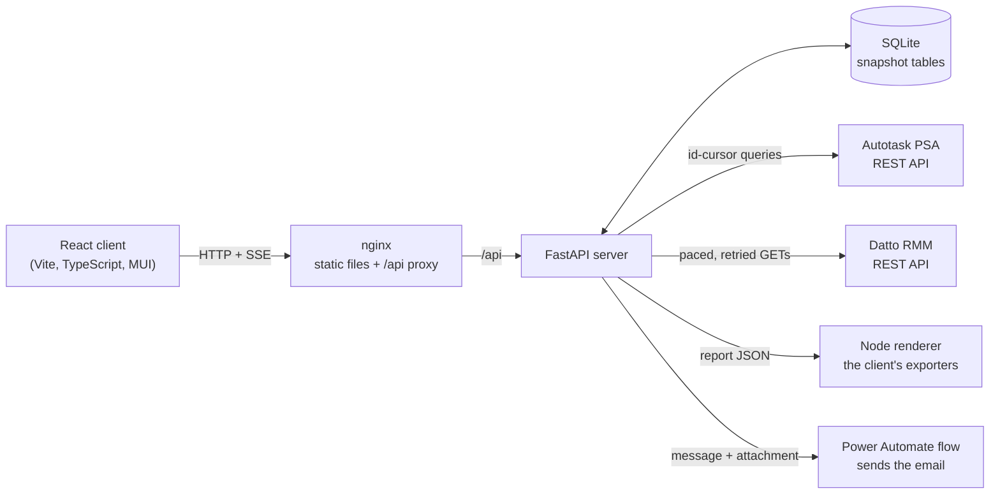

# Architecture and design notes

This document is the long-form companion to the README. It explains what the
application is, why each part exists, how a request moves through it, and the
reasoning behind the decisions that shaped it. It is written so that someone
who has read it can explain any component of the system, and defend the
choices, without opening the code.

Contents

1. [The problem](#1-the-problem)
2. [System overview](#2-system-overview)
3. [The life of a report request](#3-the-life-of-a-report-request)
4. [Server layers](#4-server-layers)
5. [Vendor integrations](#5-vendor-integrations)
6. [The snapshot cache](#6-the-snapshot-cache)
7. [Progress, streaming and cancellation](#7-progress-streaming-and-cancellation)
8. [The reports](#8-the-reports)
9. [Client structure](#9-client-structure)
10. [Exports](#10-exports)
11. [Scheduled delivery](#11-scheduled-delivery)
12. [Demo mode](#12-demo-mode)
13. [Configuration and tenant rules](#13-configuration-and-tenant-rules)
14. [Deployment boundary](#14-deployment-boundary)
15. [Deployment](#15-deployment)
16. [Quality gates and tests](#16-quality-gates-and-tests)
17. [Failure modes and how they surface](#17-failure-modes-and-how-they-surface)
18. [Trade-offs and what I would change](#18-trade-offs-and-what-i-would-change)
19. [Glossary](#19-glossary)

## 1. The problem

A managed service provider runs its business on two systems that do not talk to
each other well. Autotask PSA holds the commercial and operational record:
companies, contracts, tickets, time entries, SLAs, and an asset register of
"configuration items". Datto RMM holds the technical truth: the agent on every
machine reports its hardware, operating system, installed software and patch
state. Each client is a company in Autotask and a site in Datto, and the two
identifiers are unrelated.

Every month the MSP owed each of its clients a set of reports: what devices
they have and in what state, how many Office and Windows licences are in use,
what tickets were raised and how fast they were resolved, whether SLAs were
met, and how much engineer time was spent. For 25 clients and roughly 1,700
devices that meant about 35 reports a month plus quarterly and annual
utilization, and the data for each had to be pulled from both portals,
reconciled by hand in spreadsheets, and formatted. It took around 40 hours a
month.

This application replaces that process. It pulls from both APIs, joins the two
views of each client, caches the result locally, and produces the reports on
screen and as Excel, Word or PDF files. Any of those reports can also be
scheduled, in which case it renders itself on a day of the month and goes out
by email without anyone opening the app.

## 2. System overview



Three containers in production: nginx serving the built client and proxying
`/api`, the FastAPI server, and the Node renderer that turns a report's data
into a file when a schedule fires; SQLite is a file inside the server's data
volume, not a process. There is no queue, no cache server and no worker
process: scheduled runs happen on a thread inside the server, and the renderer
is a stateless function behind HTTP. The server is deliberately a single
process because the workload is one MSP's monthly reporting, not a
multi-tenant service; the complexity budget went into correctness of the
data, not into horizontal scale.

Key properties:

- **Vendor APIs are the source of truth.** The local database is a cache of
  point-in-time snapshots, never the system of record. Anything can be rebuilt
  by refetching.
- **Reports are long-running.** A device report for one client can make
  hundreds of paginated API calls and take minutes. The architecture treats a
  report as a job with a log stream, progress phases and cooperative
  cancellation, not as a request that returns quickly.
- **Everything is configured from the environment.** Credentials, the Autotask
  zone, the Datto platform, sync interval, CORS origins, the renderer's
  address, the delivery flow URL and the schedule timezone come from `.env`.
  Nothing tenant-specific is baked into code paths: presentation values live
  in a data file, and the one module that holds tenant rules is overridden
  from an untracked file (section 14).

## 3. The life of a report request

Take the patch management report for one agency.

1. The page calls the hook, which calls `patchApi.fetchPatchReport(siteId)`
   inside `runReportJob`. That helper opens an `EventSource` on the report's
   `/logs` endpoint, registers the run in the job store (which the status bar
   renders), and hands the fetch an `AbortSignal` wired to the bar's Cancel
   button.
2. nginx proxies `GET /api/patch-management?site_id=...` to FastAPI.
3. The router does three things: parses and validates the query parameters,
   wraps the call in `run_report`, and returns whatever the service produces.
   `run_report` starts a server-side job record, builds a logger bound to the
   report's named log stream and to that job, and maps a cancellation to HTTP
   499 and a bad argument to 400.
4. The service asks the snapshot repository for the rows of the scope
   `{site_id}` in the `patch_rows` table. On a hit it gets the stored rows and
   their `synced_at`. On a miss (or when `refresh=true`), the repository calls
   the service's `fetch_rows`, which pages through the Datto site's devices,
   filters to workstations, and returns flat row dicts; the repository then
   replaces every row for that scope in one transaction and records the
   outcome in `sync_state`.
5. The service aggregates the rows into the response shape: a status summary
   for the donut, the device list sorted worst first, and the snapshot time.
6. While step 4 runs, every log line the fetch writes goes to the named
   `LogBuffer`. The `/logs` SSE endpoint polls that buffer four times a second
   and pushes new lines to the browser. Lines prefixed `[PROGRESS]` carry JSON
   with the current phase and counts; the client parses those into the
   progress bar and shows the rest as a log tail.
7. The response arrives; the hook stores it in the report's Zustand store,
   which survives navigation so the page can be revisited without refetching.

The same path serves every report. The only differences are the scope that
identifies a snapshot, the fetch pipeline, and the aggregate function.

## 4. Server layers

```
server/
  main.py            create_app(): middleware, lifespan, sync scheduler, schedule ticker
  config.py          Settings dataclass loaded once from the environment
  report_rules.py    tenant-specific ids and business rules (see section 13)
  routers/           HTTP only
  services/          one module per report, plus sync, agencies, saved reports,
                     tenant, presets, schedules, periods and the scheduled runner
  repositories/      SQLite schema, migrations, snapshot cache, small tables
  integrations/      the Autotask and Datto clients, the renderer, the delivery flow
  core/              log buffers, SSE streams, progress phases, job record
  demo/              deterministic generators standing in for the vendors
  tests/             pytest
client/renderer/     the client's exporters under Node, behind a small HTTP front
```

Dependencies point inward: routers import services, services import
repositories and integrations, nothing imports routers. The rule that makes
the split real rather than cosmetic is that **services contain no HTTP and no
SQL**: they never see a `requests` call or a query string. The one exception is the
utilization service's small helper that reads stored time entries, and it goes
through the repository's `read_rows` rather than writing SQL.

### Routers

A router module per domain. Each report route is three lines of intent: a
label for the status bar, a lambda that calls the service with a logger, and
`run_report` around it. Request bodies are Pydantic models, so a malformed
agency or device change is rejected before any code runs.

### Services

A report service exposes the same five names:

| Name | Purpose |
|---|---|
| `snapshot(...)` | The `Snapshot(report_type, table, scope)` that identifies its cache entry |
| `fetch_rows(..., logger)` | The vendor pipeline: returns flat row dicts in the table's shape |
| `aggregate(rows, ...)` | Turns stored rows into the response payload |
| `get_<report>(..., logger, refresh)` | Read-through: cache, then `aggregate`, plus `synced_at` |
| `refresh_snapshot(...)` | What the sync calls: fetch and store, ignoring the cache |

Keeping `fetch_rows` and `aggregate` separate is what makes the snapshot
design work. Only the fetch half talks to vendors; the aggregate half is a pure
function of stored rows, which means a report can be re-rendered from the
database, re-shaped by a code change without refetching, and unit tested with
recorded rows.

Long fetch pipelines are written as a sequence of named steps. The utilization
fetch, for instance, is `collect_time_entries`, `load_staff`,
`resolve_ticket_companies`, `resolve_task_companies`, `label_entry_companies`,
`aggregate_hours`, `flatten_rows`. Each is short enough to read in one
screen, and the orchestration function reads as the description of the job.

### Repositories

`repositories/sqlite.py` owns the one connection, the schema, migrations and
the `replace_scope` primitive. `repositories/snapshots.py` is the read-through
cache (section 6). `manual_inputs`, `saved_reports`, `presets` and
`schedules` are thin row-level modules for the small tables that are not
snapshots.

### Core

`core/log_buffer.py` is a capped, thread-safe buffer whose cursors count lines
ever written rather than slots in a list, so a reader that falls behind or
arrives after a `clear()` keeps streaming instead of going silent (that bug
is what once left the status bar sitting on "Starting" through an entire
report). `core/streams.py` keeps one buffer per report type and builds the
SSE response and the per-run logger. `core/progress.py` defines the
`[PROGRESS]` wire format and a `Phases` helper so each report declares its
phases once and the bar fills across the whole run. `core/jobs.py` is the
server-side record of the current run.

## 5. Vendor integrations

### Autotask

The Autotask REST API has two quirks that shaped the client. Its query
endpoint returns at most 500 records and has no page token, so the only
reliable way to walk a large result is an `id > last_id` cursor; and some
entities (time entries among them) return nothing unless an id filter is
present, so the client sends the cursor on the very first page too. Lookups
by id go through `in` filters in chunks of 200, because a single `in` list has
a length limit. Picklist labels (ticket status, priority, device model and so
on) are numeric ids that map to labels in a large entity-information document;
the client fetches that once per entity per process and caches it, where the
original code downloaded it five times per device report.

`AutotaskClient` therefore offers `query_page`, `query_all` (cursor-paged,
with a progress callback), `query_by_ids` (chunked), `get`, `patch` and
`picklist`. Every service call maps onto one of those, and the base URL,
credentials and timeout are set once from settings.

### Datto RMM

Datto rate-limits the account to 600 reads a minute, and a full sync audits
well over a thousand devices. `DattoClient.get` paces every request across all
worker threads, retries 429 and 5xx responses with exponential backoff
(honouring `Retry-After`), and treats 401 and 403 as "drop the cached token
and re-authenticate". The OAuth token is cached behind a lock and refreshed a
minute before its advertised expiry, so a request that starts just before the
deadline does not go out with a token that dies in flight; the lock exists
because concurrent audit workers would otherwise each request their own token
when the cached one expired.

A rejected key or secret surfaces as the OAuth error itself, outside the retry
loop: a configuration mistake must not read as three failed GETs.

Datto has no bulk audit endpoint. Per-device enrichment (Office product, RAM,
C: drive) is one or two calls per device on a small thread pool whose size is
configurable. The pool is small on purpose: too many in-flight requests on a
small container time out, and a timed-out audit is indistinguishable from "no
Office installed", which lands as a blank column in a customer report.

Agents do not always live in the Datto site that matches their Autotask
company. Device resolution searches the agency's own site first and then falls
back to an account-wide scan for any hostnames still unmatched.

## 6. The snapshot cache

Every report's data lives in a table whose rows carry a **scope**: the agency
for current-state reports (`company_id`, `site_id`), the period for time-based
ones (`year`, `month`, or an inclusive date range). A fetch replaces every row
for its scope in a single transaction. There are no upserts and no row-level
merges.

I chose this over an upsert design for three reasons:

- **Correctness is trivial to reason about.** The vendor APIs are the source
  of truth, so there is nothing to merge; a snapshot is simply "what the APIs
  said at `synced_at`". A device retired from Autotask disappears on the next
  refresh instead of lingering as a stale row.
- **Readers never see a half-written state.** `replace_scope` is one
  transaction, and WAL mode lets readers proceed on the previous snapshot while
  it runs.
- **Migrations are cheap.** When a column changes shape, the right move is to
  drop the snapshot and refetch, not to backfill. `CACHE_VERSION` names tables
  whose stored rows a code fix has made untrustworthy; they are emptied once on
  startup and refilled on next view.

`sync_state` records, per report and scope, when the last refresh ran and
whether it succeeded. It does two jobs. It is what the settings page shows as
"last synced". And it settles the one ambiguity in "rows for this scope": an
empty result. An agency with no disk-space tickets has a legitimately empty
snapshot; without the `sync_state` check it would be treated as a miss and
refetched on every read.

SQLite was the right database because the whole dataset is a few hundred
thousand rows, there is one writer, and the stdlib `sqlite3` module needs no
dependency, no service and no migration framework. A single connection opened
with `check_same_thread=False` and a module-level lock serialises access from
uvicorn's threadpool; that is a deliberate trade of concurrency for simplicity
that is fine at this scale, and section 18 says when it would stop being fine.

## 7. Progress, streaming and cancellation

Reports stream their log to the browser over Server-Sent Events rather than
WebSockets because the traffic is one-directional, SSE reconnects for free and
works through the nginx proxy with two config lines (buffering off, long read
timeout). Each report type has its own named buffer so two reports running at
once never interleave.

A log line is for whoever is debugging; "Page 52: 500 time entries" tells the
person waiting nothing about how far along they are. So each report also
emits a second, machine-readable line on the same stream:
`[PROGRESS] {"phase": "Collecting tickets", "done": 1200, "total": null,
"step": 1, "steps": 3}`. Phases are named for what they achieve, not for the
API call behind them. The client gives each phase an equal slice of one bar,
fills the slice from `done/total` where the total is known and holds it at the
boundary where it is not, so the bar only ever moves forward.

The server keeps a record of the current run (`core/jobs.py`), one run at a
time: starting a second report while one is in flight replaces the record, so
the first can no longer be cancelled from the bar, which is a known limit of
the single-process design rather than an accident. It exists so
that a page reload rebuilds the status bar from the server instead of
pretending nothing is running, and so that several tabs agree. The client
polls it every two seconds and reconciles with the runs it started itself,
preferring whichever source is further along.

Cancellation is cooperative. A worker thread cannot be killed from outside,
but every report logs constantly, so the per-run logger checks the cancel
flag on each line and raises `ReportCancelled`. The route maps that to HTTP
499, nothing is written to the cache, and the status bar row stays visible
marked Cancelled rather than vanishing, so a cancelled report is
distinguishable from one that quietly failed.

## 8. The reports

| Report | Scope | Sources | What the fetch does |
|---|---|---|---|
| Devices | company + site | Autotask CIs, products, locations, picklists; Datto devices + audits | Joins the Autotask asset record to the Datto agent by hostname, enriches with Office, RAM and C: drive from the audit API, carries forward known values when an audit cycle returns blanks |
| Office / Windows | company + site | Autotask CIs; Datto devices + software audits | Counts Windows 10/11 from the agent's live OS string (Autotask's copy as fallback), counts one primary Office product per device |
| Tickets | company + month | Autotask tickets | Stores one row per ticket; aggregate buckets by source, priority and issue type, computes average time to repair per priority and first-call resolution for phone tickets |
| SLA | month | Autotask tickets, resources, companies, picklists | Stores each closed ticket with its SLA metrics; aggregate rebuilds the per-resource pivot |
| Utilization | inclusive date range | Autotask time entries, tickets, tasks, projects, companies, resources, roles | Attributes every hour to a company via ticket or task, and to a billing tier via the role it was booked under |
| Patch | site | Datto devices | Workstation patch status from the agent |
| Disk-space tickets | company | Autotask tickets + CIs | Devices the RMM raised "C: near full" tickets for, with the drive size parsed from the alert title |

The device grid is the one place the app writes to a vendor. Each stored row
carries its Autotask configuration item id; edited cells are grouped per
device, checked against the short list of editable user-defined fields, and
sent as one PATCH per device, with the outcome reported per device rather
than as a single success or failure.

Two details are worth knowing because they look wrong until explained.

Devices carry forward a previously known Office version, RAM or drive size
when a fetch returns a blank. Datto's audit data is not always complete at
the moment of a sync; a device can be missing its software audit in one cycle
and have it in the next with no change on the machine. Because a sync
replaces the whole scope, a blank would otherwise overwrite a good value and
leave the column empty until a later sync happened to catch a full audit.

Utilization attributes hours to a billing tier by the **role on the time
entry**, not by the engineer's current department. The role is what the work
was billed at; using the department would retroactively recategorise history
whenever someone changed role.

## 9. Client structure

```
client/src/
  api/          one module per server domain plus types.ts; the only API calls
  store/        Zustand stores: one per report, shared job/agency/theme/toast stores
  hooks/        per-report data hooks on a shared tracked-report runner
  components/   app shell (NavBar, status bar, toaster) and report building blocks
  pages/        route components composed from the above
  utils/        dates, Excel styling, PDF header, agency groups, file delivery
```

Beside `src/`, `client/renderer/` is a Node entry point that imports the same
export modules and serves them over HTTP for scheduled runs (section 11).

The client is TypeScript in strict mode. Every server response has a type in
`api/types.ts`, so a renamed field on the server fails the build instead of
rendering as undefined.

Report state lives in Zustand stores rather than component state because
reports take minutes and a component-held result would be lost the moment
the user navigated away. Each report hook subscribes to its store field by
field (so a log line arriving does not re-render the data grid) and runs its
fetch through `useTrackedReport`, which owns the lifecycle every report
shares: mark loading, clear the log, run the job with the status bar tracking
it, store the result or the error, and never treat a cancellation as a
failure.

The home page is a card per report, each with its icon and a one-line
description, built from the same navigation table the sidebar uses so the
two cannot drift apart.

A page is composition. `ReportPage` provides the frame, `ReportToolbar` the
control bar, `AgencySelect` and `MonthYearSelect` the inputs, `ReportActions`
the fixed button order (export, save, refresh, generate), `ReportProgress` the
spinner and log tail, and `DataTable` the plain lists. Page-specific pieces
(pivot tables, export builders, settings dialogs) sit in a folder next to the
page so each page file is mostly the wiring.

Agencies that exist in Autotask as several companies but are one organisation
can be grouped. A group appears as one dropdown entry; the hook fetches each
member and merges the results (summing counts, re-weighting averages by
ticket count, unioning device lists) so the report reads as one client.

## 10. Exports

Exports are built in the browser from the data already on screen, which keeps
the server stateless about formatting and means the export reflects any
filter the user applied. Excel workbooks are built with exceljs, Word with
docx, and PDF with jsPDF plus autotable. The libraries are loaded on demand so
they do not weigh on the initial bundle. One palette (`utils/excel.ts`,
`utils/pdf.ts`) is shared so a set of reports looks like a set.

"Export" downloads the file and also uploads it to the server; "Save to app"
uploads only. The server stores the bytes under its data volume with a
metadata row, de-duplicating by filename so an export repeated the same day
replaces its earlier copy. The Saved Reports page lists them, renders
workbooks in place and hands PDFs to the browser's viewer.

Each builder is a pure function of an input object: the rows to print, the
heading, and the images to embed, already loaded. The page assembles that
input from the API payload and the saved figures in a small module of its own
(`exportInput.ts`, `workbookInput.ts`). That split is what lets the same
builders run outside the browser, which the next section is about.

## 11. Scheduled delivery

The reports exist so that each client gets a pack at the start of the month,
and once the data pipeline worked the remaining manual step was the delivery
itself: open the app, pick the agency, generate, export, attach, send, some
thirty-five times. I wanted the pack to leave on its own, and to leave as the
exact view the engineer had configured, with the same columns, the same
Word-or-PDF choice and the same rates, rather than as a server-side
approximation of it.

### Presets, schedules and runs

A **preset** is a report as configured on screen, stored so it can be
rendered without a browser: the report type, the agency key (a company id or
`group:<name>`; agency-wide reports such as SLA and utilization have none)
and the options the exporter reads. The service cuts the options down to the
keys the renderer's handler for that type actually uses, and type-checks
them: the device columns, the licensing format and whether licence counts are
shown, the annual report's company filter and rate overrides. Validation
happens at save time on purpose. A preset that will fail at seven in the
morning should fail in front of the person saving it. Presets are created
from the Schedule button on each report page, which describes the report on
screen as a draft; the dialog stores the preset first and the schedule
second, and removes the preset again if the schedule is refused, so a failed
save leaves nothing behind.

A **schedule** attaches timing and recipients to a preset: a day of month, an
hour, the To and CC lists, and a subject and body. The day and hour are read
in the deployment's `SCHEDULE_TIMEZONE`; the next run is computed as a
wall-clock time in that zone and converted to UTC afterwards, so a
daylight-saving change between now and the run is reflected. A day past the
end of a month runs on that month's last day, so "the 31st" means month end
everywhere. Subject and body may carry `{agency}`, `{report}`, `{period}` and
`{date}` placeholders, filled by a plain substitution rather than
`str.format`, so a stray brace or an empty `{}` is left as typed instead of
failing the run over a typo. The default subject is `{agency} {report}
{period}`.

A **run** is the record of one attempt: which schedule, what triggered it
(the ticker, or the page's Run now button), when it started and finished, its
status, the error if any, and the id of the saved report it produced. The
Scheduled Reports page lists the schedules with their next and last run,
follows the runner's log stream, and shows the history of the selected
schedule. It also offers the two checks worth making before anyone waits for
the first of the month: whether the renderer answers its health check, and a
test message through the delivery flow.

### Which period a run reports on

A schedule fires early in a month, and what it sends is about time that has
finished. The SLA report takes the previous month; the quarterly utilization
takes the previous calendar quarter; the annual utilization takes the
reporting year that the previous month falls in, so a run in the first month
of a new reporting year still sends the year that just closed. Current-state
reports (devices, licensing, patch, disk-space tickets) have no period; they
say what the snapshot says on the day. The arithmetic reuses the utilization
service's quarter and fiscal-year helpers rather than duplicating the
calendar.

### The renderer

The exporters were already written, in TypeScript, for the browser: exceljs,
docx and jsPDF code that knows every column, colour and heading of every
report. Rewriting them in Python would have meant two implementations of each
file that had to agree forever, and the first time they disagreed, the copy
that mattered (the one a client received) would be the one nobody was
looking at. So the scheduled path runs the same builders under Node. The
renderer is a small HTTP service in `client/renderer/` that imports the
export modules from the client source and keeps one handler per report type;
the builders themselves are untouched, so a scheduled file and a downloaded
one come from identical code and carry the same bytes.

Two refactors made that possible. The builders used to reach into the page:
they fetched the agency logo and the product icons over HTTP, and some
assembled their input from component state. Both habits were removed. An
input module per report turns the API payload plus the saved figures into
exactly what the builder prints, and images are passed in as input rather
than fetched inside. In the browser the icons come from `public/`; in the
renderer they are read from disk, and the agency logo arrives in the request
as base64, because the renderer has no tenant settings of its own.

The contract is one POST of `{reportType, data, options, filename,
logoBase64}` to `/render`, answered with the file bytes, their content type
and a content-disposition carrying the filename; `/health` returns the report
types it knows. The body is capped at 50 MB, and a larger one is answered 413
before the connection is dropped, so the caller sees a status rather than a
reset. The service checks only that `data` is an object: the payload is JSON
the Python side built itself, so the per-report shape is a contract between
the two, and a wrong shape fails inside the builder as a 500 that the run
records.

Two things the browser does are not reproduced. The patch PDF's donut is a
rasterised copy of the on-screen chart, and there is no screen, so the
scheduled PDF draws the legend alone. And where the browser merges a grouped
agency's licensing and patch data into one report, the renderer covers a
group's first member only and says so in the run log; the device and
disk-space reports do handle groups, member by member.

### The ticker and the runner

Timing is deliberately plain. Once the server is up, a task on the event loop
checks for due schedules once a minute, handing the one SQLite query to a
worker thread because a snapshot swap can hold the database lock for a while
and nothing on the event loop should wait for it. "Due" is `next_run_at <=
now`, not equality, so a tick that arrives late, or a minute the server slept
through, picks the run up rather than skipping it. Both sides are ISO-8601
UTC strings with an offset compared as text, which is only correct because
the schedules service is the sole writer of that column and always writes
that format.

Runs happen one at a time on a single daemon thread. The ticker and the
page's Run now button both go through the same gate, so two reports never
render at once and a manual run cannot overlap a scheduled one; while a run
is in flight nothing starts, and whatever was due is picked up on the next
tick after it finishes. The first thing a scheduled run does, before fetching
anything, is advance its schedule's next run to the following occurrence, so
a crash mid-run cannot leave the schedule due again on the next tick and
send twice. The mirror image is that a failed run is not retried until next
month, which is what I wanted: the failure is recorded on the run and on the
schedule, the page shows it, and Run now is one click away. On startup the
server sweeps any run row a previous process left open and closes it as
interrupted; its schedule was already advanced, so it is recorded as an error
rather than silently re-run.

A run then does four things in order: gather the data through the same
service calls the browser uses (cache first, so a run after the nightly sync
is quick), render, save the file to Saved Reports under the filename the
browser would have used (so a manual export of the same report on the same
day replaces it rather than sitting beside it), and deliver. Every failure is
recorded on the run and the schedule rather than raised.

### Delivery

I did not want the app to hold a mailbox. The MSP's mail is Microsoft 365,
and sending from a shared reporting address properly means either the Graph
API with an application registration and an admin-consented send permission,
or SMTP with that mailbox's password stored on the server. Both put a
credential that can send email as the organisation into a container I run. A
Power Automate flow with an HTTP trigger avoids that: the flow is signed in
as the reporting account inside Microsoft 365, an admin can change who the
mail comes from without touching the app, and the app holds exactly one
secret, the flow's signed trigger URL, in `.env`. Regenerating the trigger is
how access is revoked.

The message is one JSON document: `to` and `cc` as arrays, `subject`,
`body`, and `attachments` as `{name, contentType, contentBytes}` with the
file base64-encoded in the body. The flow's trigger schema declares exactly
that shape, and a Select action inside the flow renames the keys to what the
mail connector expects, so the server never learns the connector's spelling.
The connector treats the body as HTML, so the server escapes the text and
turns the schedule's line breaks into `<br>` before posting. A 20 MB workbook
becomes about 27 MB of JSON, inside the trigger's limit. Any 2xx from the
flow counts as delivered; the flow's own run history is the audit trail of
the send.

The trigger URL is the one thing the delivery module never logs. A failed
request's exception text quotes the URL, signature included, so only the
host and the kind of failure are passed on; a refusal is reduced to the
flow's own error message, or a capped single line of the response, before it
is stored on the run.

### Failure modes

If the renderer is down, the run fails at the render step with the address
it tried; nothing is saved and nothing is sent. If the delivery flow is down
or refuses the message, the file has already been saved to Saved Reports,
the run is recorded as an error alongside that saved report's id, and
nothing is resent: the file can be opened or forwarded by hand, and next
month's run is unaffected. If a preset's agency has been removed from the
agency list, the run fails with a message naming the agency and asking for
the preset to be edited, and the renderer is never called. An invalid
`SCHEDULE_TIMEZONE` is caught when a schedule is saved, as a 400 naming the
variable, and again when a run tries to advance its schedule, where it lands
on the run record. A deleted preset cannot strand a schedule, because the
preset service refuses to delete one that a schedule still renders.

### What I left out

No Graph client and no SMTP: one flow, one URL. No automatic retries: a
failed run is visible, its file is saved where the failure allowed, and a
retry loop against a mail connector that may already have sent is worse than
a person pressing Run now. Day-of-month schedules only: everything the MSP
owes is monthly, quarterly or annual, and all three fit a day and an hour, so
there are no weekly or cron-style schedules. One sender: the flow decides who
the mail comes from, and a per-schedule sender would mean per-schedule
credentials, which is the thing the design exists to avoid.

## 12. Demo mode

`DEMO_MODE=1` makes the application run end to end with no vendor accounts.
The hook is a single branch in the snapshot repository: on a cache miss it
calls a generator in `server/demo/` instead of the service's `fetch_rows`.
The generators return rows in the exact shape the real fetches return, emit
the same `[PROGRESS]` phases, and pause briefly so the live-progress UI is
exercised. They are seeded from the scope, so the same agency always has the
same devices and the same month the same tickets, across restarts and across a
sync. Nothing is derived from Python's salted string hash.

The invented estate is 25 agencies and about 1,700 devices, matching the real
deployment's size so the screenshots and the performance characteristics are
honest. `python -m demo.seed` runs the normal sync against the generators.
Nothing in the demo data comes from a real tenant.

## 13. Configuration and tenant rules

`config.py` loads a frozen `Settings` dataclass once from the environment.
Outside demo mode every credential, the Autotask zone and the Datto platform
are required at startup, and a missing one fails fast with the variable's name
rather than producing an authentication error minutes into a report. The
Datto REST base and OAuth endpoint are both derived from the platform, so
there is one setting to get right, not two that can disagree.

`report_rules.py` is the one place that holds the rules another MSP would
change to run these reports against its own Autotask. Autotask picklist
values (ticket sources, priorities, issue types, statuses) are numeric ids
chosen per tenant; SLA targets, billing tiers and the fiscal calendar are
contractual. Keeping them in a single documented module, with generic
category labels, means the services themselves contain no tenant knowledge.
The next section explains how a deployment supplies its own values without
editing that module.

## 14. Deployment boundary

This repository is public, and the deployment that runs it is a private fork.
Everything that identifies the deployment therefore lives in files upstream
never touches, so that `git merge upstream/main` in the fork is conflict-free
by construction. There are three such homes, each with a tracked example
beside it and each excluded by `.gitignore`.

`server/.env` holds what the process needs to start: vendor credentials, the
Autotask zone, the Datto platform, the sync interval, the data directory, the
renderer's address, the delivery flow URL and the schedule timezone.
`.env.example` documents each.

`server/data/` holds what the application reads at run time and writes
itself: the SQLite file (and with it the licence counts, presets, schedules
and run history), `agencies.json` with the client list, the saved reports,
and two things that used to be constants in client source: `tenant.json` and
the `logos/` folder. `tenant.json` carries the presentation settings: the
agency groups, the agency-to-logo mapping, the rated departments with their
billing rates, and the year floors for the pickers; `tenant.example.json`
shows the shape. The server lays it over built-in defaults and serves the
result at `GET /api/tenant`, and the logos at `/api/tenant/logos/{filename}`
with the name checked so it can only denote a file directly under that
folder. The client reads the endpoint into a store, so the browser bundle
contains nothing about the tenant, and the scheduled path reads the same
file for the annual report's departments and for the logo it sends the
renderer. The compose file mounts this directory as a volume so all of it
survives a redeploy.

`server/report_rules_local.py` overrides `report_rules.py`. The tracked
module holds the picklist ids, SLA targets, role tiers and fiscal month with
generic values; at import time it replaces any constant with the value of
the same name from the local file. Only names that already exist are
honoured, and an uppercase name that does not is reported with a warning, so
a typo in the local file shows up in the log instead of silently creating an
unused rule. A missing local file is fine; a broken import inside a real one
is raised, because that is a broken deployment, not an optional file.

The rule for anything new is the same: a deployment-specific value must be
read from `.env`, `data/` or `report_rules_local.py`, and adding one to
tracked source is a bug. The
[fork workflow](operations/Reporting%20Fork%20and%20Upstream%20Workflow.md)
has the setup steps.

## 15. Deployment

Three images. The client image is a two-stage build: Node builds the Vite
bundle, nginx serves it and proxies `/api` to the server container over the
compose network. The server image is `python:3.11-slim` running uvicorn. The
renderer image is `node:20-alpine` running the client's exporters through
`tsx`, reachable by the server as `http://renderer:3100` and never published
to the host. The compose file mounts a volume at the server's data directory
so the SQLite file, the agency list, the tenant settings and logos, and the
saved reports survive redeploys. A compose override runs the whole stack in
demo mode with a one-command seed.

The server refreshes every snapshot on a schedule (24 hours by default) and on
demand from the settings page. Only one sync runs at a time; the runner holds
the status the settings page polls and writes its log to a stream the page
follows. Scheduled report runs are the same shape on their own thread, with
their own status, log stream and once-a-minute ticker (section 11).

## 16. Quality gates and tests

CI runs on every push and pull request: Ruff lint and format, Bandit and
pip-audit on the server; ESLint, Prettier, `tsc --noEmit`, Vitest and a
production build on the client; and a Docker build of all three images. Nothing is
published from CI; deployment is `docker compose up -d --build` on the host,
or a `pull` of images built elsewhere once the compose file names a registry.

Tests are deliberately few and aimed where logic is dense and cheap to
exercise: the snapshot cache against a temporary SQLite file (hit, miss,
refresh, error, empty scope), the Autotask client's pagination against a
stubbed session, the aggregate functions against recorded rows, and the
client's agency grouping, job-store reconciliation and the two shared report
controls. The device write-back has its own tests: field validation, grouping
per device, and per-device failure reporting against a stubbed client.
Scheduled delivery is tested at its seams: the next-run arithmetic across
month ends, the placeholder substitution, the preset validation, the
runner's one-at-a-time gate and its catch-up after a run, a whole run against
a stubbed renderer and flow (a failed render, a failed delivery after the
save, an agency that no longer resolves), the delivery message shape and what
its error messages leave out, and the renderer's own handlers and HTTP front,
body cap included.

## 17. Failure modes and how they surface

| Failure | What happens | Where it shows |
|---|---|---|
| Vendor API down or credentials rejected | The fetch raises; the cache keeps the previous snapshot; `sync_state` records the error | Status bar row turns Failed with the message; `/api/sync/state` lists the scope with its error |
| Datto rate limit | 429 is retried with backoff and `Retry-After` | Log stream shows the retry; the report slows rather than fails |
| Token expiry mid-sync | 401 drops the cached token; the retry re-authenticates | Transparent |
| Audit returns blanks for a device | Known Office, RAM and drive values are carried forward from the prior snapshot | Log line names the carried fields |
| Report cancelled from the status bar | Worker unwinds at its next log line; nothing cached; HTTP 499 | Row stays, marked Cancelled |
| Page reloaded mid-report | Server job record is adopted by the status bar on the next poll | Progress continues from the server's view |
| Empty scope (no tickets, no offenders) | Served as a cached empty snapshot via `sync_state` | No refetch; "data as of" still shown |
| Bad date range | `ValueError` in the service maps to HTTP 400 with the reason | Error banner on the page |
| Renderer unreachable during a scheduled run | The run fails at the render step; nothing is saved or sent; the schedule has already advanced | Run row marked error with the renderer's address; the Scheduled Reports page shows it against the schedule |
| Delivery flow down or refusing the message | The file is already in Saved Reports; the run is recorded as an error with that saved report's id; nothing is resent | Run row marked error with the flow's message; the file can be opened from Saved Reports |
| Server restarted mid-run | Open run rows are closed on the next start; the schedule was advanced first, so the run is not repeated | Run row marked error, "Interrupted by a restart" |

## 18. Trade-offs and what I would change

- **One process, one SQLite file.** Right for one MSP's reporting; wrong for
  many tenants or many concurrent writers. The repository layer is the seam:
  swapping SQLite for Postgres touches `repositories/sqlite.py` and nothing in
  services.
- **Reports run inside the request.** A report is a long HTTP request on a
  threadpool worker, which is why uvicorn's graceful shutdown window is set
  short and why cancellation is cooperative. A task queue would decouple the
  request from the work and allow true cancellation, at the cost of another
  process to run; I would add one before adding a second concurrent user.
- **Exports are built client-side, and again under Node.** Simple and
  filter-aware in the browser; the scheduled path runs the same builders in a
  Node container rather than rewriting them, which costs a third image and a
  second runtime but keeps one implementation of every file.
- **Delivery depends on a Power Automate flow.** It keeps mail credentials
  out of the app, but it is a thing someone in the tenant has to own. A Graph
  client would remove that dependency at the price of holding a credential
  that can send mail as the organisation.
- **Hostname is the join key** between Autotask and Datto. It is what both
  systems expose and it works for a managed estate where agents are installed
  by the MSP, but it is not a stable identifier; a device re-imaged under a
  new name shows as new.

## 19. Glossary

- **Agency**: a client of the MSP; an Autotask company paired with a Datto site.
- **Configuration item (CI)**: Autotask's asset record for a device.
- **Scope**: the key columns that identify one snapshot in a table.
- **Snapshot**: all rows for a scope as of one fetch; replaced whole on refresh.
- **Phase**: a named stage of a report, carried on the `[PROGRESS]` line.
- **Job**: the server's record of the report currently being generated.
- **Sync**: the scheduled or manual refresh of every snapshot.
- **Preset**: a report as configured on screen (type, agency, exporter
  options), stored so a schedule can render it without a browser.
- **Schedule**: a day of month, an hour, recipients and a message attached to
  a preset; it owns the next run time.
- **Run**: the record of one attempt to execute a schedule: trigger, timing,
  status, error and the saved report it produced.
- **Renderer**: the Node service that runs the client's exporters and returns
  the file for a report's data.
- **Delivery flow**: the Power Automate flow that receives one message from
  the server and sends it as an email from the organisation's mailbox.
